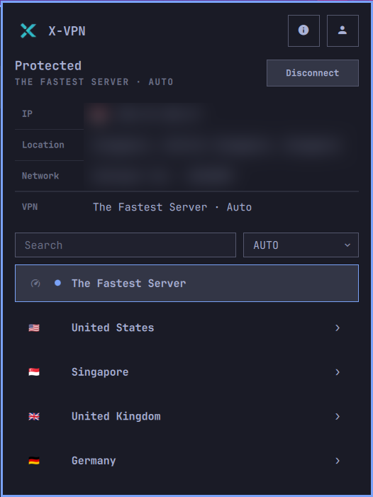

[](https://github.com/mamal72/omarchy-xvpn/actions/workflows/ci.yml)

# 🔐 X-VPN for Omarchy

A native [Omarchy](https://omarchy.org) bar plugin for the official X-VPN Linux CLI.

## 📸 Preview



## ℹ️ About

X-VPN for Omarchy brings the official X-VPN Linux CLI into a compact, keyboard-friendly bar panel. It keeps connection controls, account state, server selection, protocol choice, and public exit-IP verification in one native Omarchy surface.

This is an independent community plugin. It is not affiliated with or endorsed by X-VPN.

## ✨ Features

- Connect, disconnect, and switch locations without leaving the bar
- Country accordions with flattened city and server choices
- Fastest Server pinned above the country list
- Fuzzy location search and complete keyboard navigation
- Protocol selection using the options reported by X-VPN
- Automatic public IP, location, network, and VPN details
- Login, logout, and account status from the X-VPN CLI
- Theme-aware connected-location highlighting and bar state
- Official setup guide and CLI availability checks
- IPC actions for shortcuts and automation

Geo-list direct routing is intentionally out of scope for this release. Its planned boundary is documented in [ARCHITECTURE.md](ARCHITECTURE.md).

## 📋 Requirements

- Omarchy with shell plugin support
- `curl`, `flock` (util-linux), and `xdg-open` (xdg-utils)
- The X-VPN Linux CLI and a supported X-VPN account

X-VPN's [Linux documentation](https://xvpn.io/download/vpn-linux) currently states that Linux CLI access requires Premium.

## 📦 Installation

```bash
omarchy plugin add https://github.com/mamal72/omarchy-xvpn.git --enable
```

Install the X-VPN Linux CLI separately using the [official Linux CLI installation guide](https://xvpn.io/help-center/use-vpn-on-linux-with-command-line). CLI installation, updates, and repair are managed by the user, outside this plugin.

If the CLI is unavailable, the panel offers **Open installation guide** and **Refresh**. After installing the CLI, select **Refresh** to load its status and connection controls. If its daemon is not running, the panel points to the same guide for setup help.

## 🔄 Update

```bash
omarchy plugin update xvpn
```

## 🗑️ Remove

```bash
omarchy plugin remove xvpn
```

## 🖱️ Usage

| Input | Action |
| --- | --- |
| Left click | Open or close the panel |
| Right click | Connect to the fastest server or disconnect |
| Middle click | Refresh X-VPN and public IP details |
| `/` | Focus search |
| `Up` / `Down` or `J` / `K` | Select a location |
| `Enter` | Expand/collapse a country or connect to a leaf location |
| `Right` / `Left` | Expand/collapse the selected country |
| `D` | Disconnect |
| `R` | Refresh |

Every location row also exposes a **Connect** button on hover.

Use the account menu to log in or log out. Both actions open an interactive terminal; complete any prompts there (type `yes` when X-VPN asks you to confirm logout). Account actions share the CLI lock with background queries, and account status refreshes automatically. Credentials stay in the X-VPN terminal flow.

IPC examples:

```bash
omarchy-shell xvpn status
omarchy-shell xvpn connect "United States"
omarchy-shell xvpn disconnect
omarchy-shell xvpn refresh
omarchy-shell xvpn login
omarchy-shell xvpn logout
```

## 🔒 Privacy and security

When the panel opens or the connection changes, it requests public IP metadata from [`ipwho.is`](https://ipwho.is). This sends your public IP to that service; no X-VPN credentials are included. IP data is kept only in memory.

Omarchy plugins run unsandboxed. Review this repository before enabling it. This plugin never stores account credentials or downloads or executes installers. See [SECURITY.md](SECURITY.md) for reporting guidance.

X-VPN and its logo are trademarks of their respective owner.

## 🛠️ Development

```bash
node tests/xvpn.test.js
omarchy plugin validate .
```

Keep CLI parsing side-effect free in `model/Xvpn.js`, and add fixtures whenever X-VPN output changes. See [ARCHITECTURE.md](ARCHITECTURE.md) for the component boundaries.

GitHub Actions runs the model tests, validates the manifest, and parses the QML entry point. Pushing a version tag such as `v1.0.2` publishes a GitHub release after every check passes; the tag must match the version in `manifest.json`.

## ☕ Support my work

If this plugin is useful to you, you can [Buy Me a Coffee](https://buymeacoffee.com/mamal72).

## 📄 License

[MIT](LICENSE)
